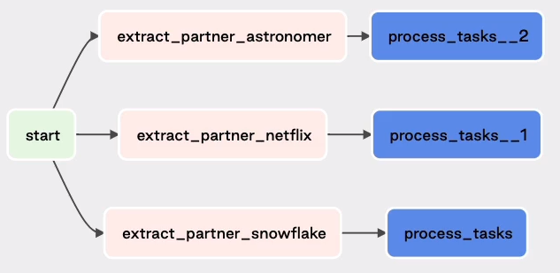
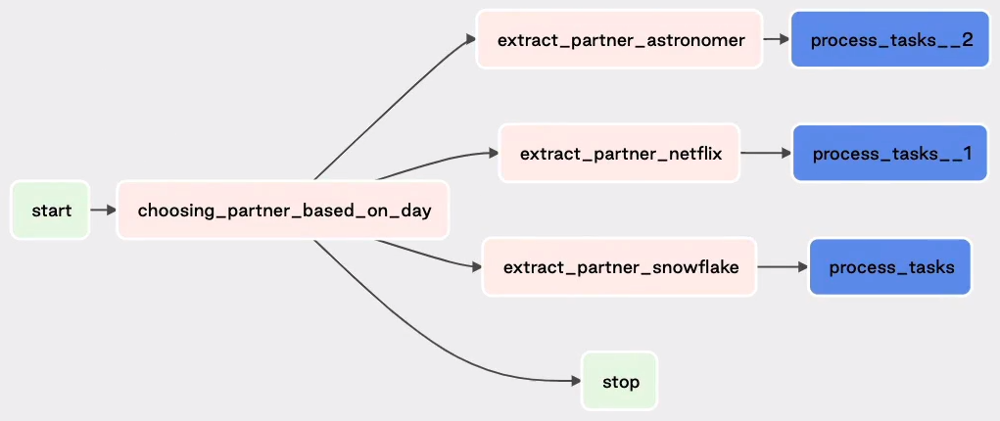
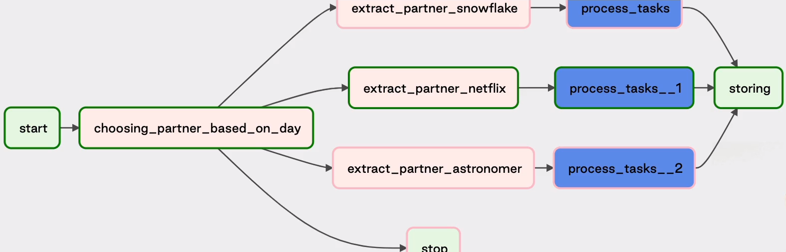
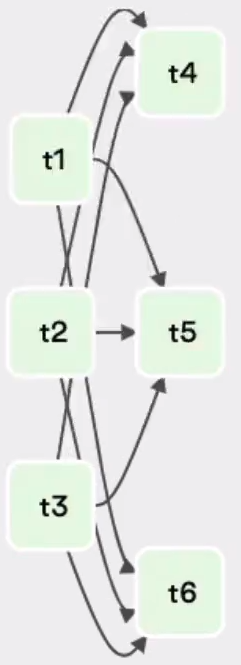
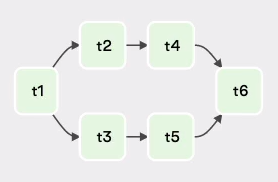
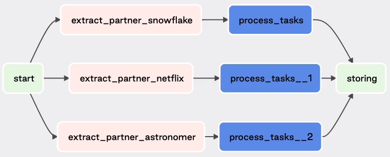
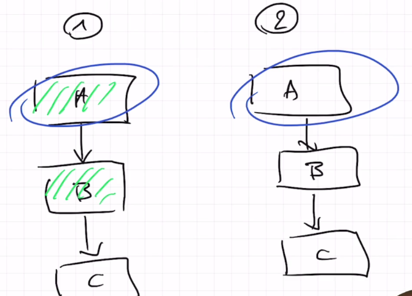

# Airflow Dag Authoring
## Table of Contents
5. [Advanced Concepts](#advanced-concepts)
6. [DAG dependencies](#dag-dependencies)

## Advanced Concepts 
### The (not so) dynamic tasks
If you have task that are similar.

To do that is possible use a loop getting data form a dictionary. 
> NOTE: all values must be knew before parses the DAGs

`add_suffix_on_collision=True`: Airflow automatically add a task sufix \

```python
from airflow.utils.task_group import TaskGroup
from airflow.decoratos import task

partners = {
    "partner_snowflake": {
        "name": "snowflake",
        "path": "/partners/snowflake"
    },
    "partner_netflix": {
        "name": "netflix",
        "path": "/partners/netflix"
    },
    "partner_astronomer": {
        "name": "astronomer",
        "path": "/partners/astronomer"
    },
}

def process_tasks(partner_settings):
    with TaskGroups(group_id="process_tasks", add_suffix_on_collision=True) as partner_tasks:
        with TaskGroup(group_id="test_tasks") as test_tasks:
            check_a()
            ...

        process_a(partener_settings["partner_name"], partner_settings=["partner_path"]) >> test_tasks
        ...


with DAG(...) as dag:

    start = DummyOperator(task_id="start")
    for partener, details in partners.items():
        @task.python(task_id="extract_partners", do_xcom_push=False, multiple_outputs=True)
        def extract(partner_name, partner_path):
            return {"parner_name": partner_name, "partner_value": partener_value}
        
        exracted_values = extract(details["name"], details["path"])
        start >> extracted_values
        process_taks(extracted_values)

```



### Make your choices with Branching
#### `BranchPythonOperator`

```python
from airflow.operatos.python import BranchPythonOperator


def _choosing_partner_based_on_day(execution_date):
    day = execution.date.day_of_week
    if day == 1:
        return "extract_partner_snowflake"
    elif day == 3:
        return "extract_partner_netflix"
    elif day == 5:
        return "extract_partner_astronomer"
    else:
        return "stop"

with DAG(...) as dag:

    start = DummyOperator(task_id="start")
    
    choosing_partner_based_on_day = BranchPythonOperator(
        task_id="choosing_partner_based_on_day",
        python_callable=_choosing_partner_based_on_day
    )
    
    stop = DummyOperator(task_id="stop")
    choosing_partner_based_on_day >> stop
    
    for partener, details in partners.items():
        @task.python(task_id="extract_partners", do_xcom_push=False, multiple_outputs=True)
        def extract(partner_name, partner_path):
            return {"parner_name": partner_name, "partner_value": partener_value}
        
        exracted_values = extract(details["name"], details["path"])
        start >> choosing_partner_based_on_day >> extracted_values
        process_taks(extracted_values)
```



#### Using Trigger Rules

```python
with DAG(...) as dag:

    start = DummyOperator(task_id="start")
    
    choosing_partner_based_on_day = BranchPythonOperator(
        task_id="choosing_partner_based_on_day",
        python_callable=_choosing_partner_based_on_day
    )
    
    stop = DummyOperator(task_id="start")
    storing = DummyOperator(task_id="storing", trigger_rule="none_filed_or_skipped")
    choosing_partner_based_on_day >> stop
    
    for partener, details in partners.items():
        @task.python(task_id="extract_partners", do_xcom_push=False, multiple_outputs=True)
        def extract(partner_name, partner_path):
            return {"parner_name": partner_name, "partner_value": partener_value}
        
        exracted_values = extract(details["name"], details["path"])
        start >> choosing_partner_based_on_day >> extracted_values
        process_taks(extracted_values) >> storing
```




### Change task execution with Trigger Rules
A trigger rule defines the behavior of your task, Why your task is going to be trigger
[doc](https://marclamberti.com/blog/airflow-trigger-rules-all-you-need-to-know/)
Rules:
* `all_sucess`: means that the task will be executed if all parents task have been succeeded
* `all_failed`: run if all parents have failed (email or slack notification)
* `all_done`: run without care status of the parents tasks
* `one_failed`: As soon as one of the upstream tasks fails, your task gets triggered.
* `one_success`: Like with `one_failed`, but the opposite. As soon as one of the upstream tasks
  succeeds, your task gets triggered. This task does not wait for all parents.
* `none_failed`: your task gets triggered if all upstream tasks haven’t failed and at least one has
  succeeded.
* `none_skipped`: your task gets triggered if all upstream tasks haven’t skipped and at least one has
  not skipped
* `none_failed_or_skipped`
* `dummy`: Run every time.

### Dependencies and Helpers
####  Dependencies
* `set_upstream`
* `set_downstream`
* `cross_downstream`
  ```python
  from airflow.models.baseoperator import cross_downstream
  ...
  with DAG(...) as dag:
      
      cross_dowstream([t1, t2, t3], [t4, t5, t6])
  ```
  
  > NOTE: can not do `cross_dowstream([t1, t2, t3], [t4, t5, t6]) >> t7`
* `chain`
  ```python
  from airflow.models.baseoperator import chain
  ...
  with DAG(...) as dag:
      
      chain(t1, [t2, t3], [ t4, t5], t6)
  ```

  
      
* If do both `cross_downstream` and `chain`
  ```python
  cross_downstream([t2, t3], [t4, t5])
  chain(t1, t2, t5, t6)
  ```
  
  
  
### Get the control of your tasks
* `PARALLELISM` : (default 32) Defines the number of tasks that can be executed at same time in
  Airflow
* `DAG_CONCURRENCY`: (default 16) Defines the number of task that can be executed at same time for a
  given dag
* `MAX_ACTIVE_RUNS_PER_DAG`: (default 16): Defines the number of dags runs that can be executed at
  same time

* Dag Level
 ```python
 with DAG(...
     concurrency=2, # 2 task running at same time across all dags runs for a given dag
     max_active_runs=1 # 1 dag run at same time for a given dag
 ) as dag:
     # 1 task istance for start running at the time for all dag runs  for this dag.
     start = DummyOperator(..., task_concurrency=1)
 ```

### Dealing with resource consuming tasks with Pools

If we have task with a lot of resource consuming so we might run one task at time only for a
specific of task and run other group of tasks at same time.

#### Pool
all task run in `default_pool` (=128), but is possible add new Pool where
* Pool - `partner_pool`
* Slots - `1`

then
```python
with DAG(...) as dag:

    start = DummyOperator(task_id="start")    
    storing = DummyOperator(task_id="storing", trigger_rule="none_filed_or_skipped")
    
    for partener, details in partners.items():
        @task.python(task_id="extract_partners", do_xcom_push=False, pool="partner_pool", multiple_outputs=True)
        def extract(partner_name, partner_path):
            return {"parner_name": partner_name, "partner_value": partener_value}
        
        exracted_values = extract(details["name"], details["path"])
        start >> extracted_values
        process_taks(extracted_values) >> storing
```
Where `extract_partner_snowflake`, `extract_partner_netflix` and  `extract_partner_astronomer`
runs one task at time.



Also is possible use `pool_slots=1` that define the workslots that is taken by a task.

**NOTE**: If use 
```python
SubDagOperator(task_id="subdag", subdag=..., pool="partner_pool")
```
the pool `partner_pool` won't be used by the tasks within the sub dag.
the poll will be used only for the dag runs.


### Execute critical tasks first, the others after
If you need to add priority for a given task. where the higher number means a higher priority, as
long as the tasks will be in the same pool

> NOTE: if you trigger the dag manually the priority won't matter

```python
partners = {
    "partner_snowflake": {
        "name": "snowflake",
        "path": "/partners/snowflake",
        "priority": 2
    },

...

    for partener, details in partners.items():
        @task.python(task_id=f"extract_{partners}", priority_weight=details['priority'], do_xcom_push=False, multiple_outputs=True)
        def extract(partner_name, partner_path):
            return {"parner_name": partner_name, "partner_value": partener_value}
```

### What if a task needs the output of its previous execution?

Allow run a task only if the previous execution for the same task was succeed

```python
    for partener, details in partners.items():
        @task.python(
            task_id=f"extract_{partners}", depends_on_past=True, 
            priority_weight=details['priority'], do_xcom_push=False, multiple_outputs=True)
        def extract(partner_name, partner_path):
            return {"parner_name": partner_name, "partner_value": partener_value}
```
### Demystifying wait for downstream

Allow run a task only if the previous execution for same task was succeed as well as the task
directly in downstream.




### All you need to know about Sensors
* Sensor: Operator that is waiting for a condition to be true before execute the next task

If you set `mode="poke"` and the condition never is true so the task will wait forever, so the
 resources used by this task will be taken forever. It's better use `reschedule` that schedules the
 sensor for `poke_interval`

```python
from airflow.sensor.date_time import DateTimeSensor

with DAG(...) as dag:
    ...
    delay = DateTimeSensor(
        task_id="delay",
        target_time="{{ execution_date.add(hours=9) }}",
        poke_interval=60 * 6, # seconds, frequency that airflow check if condition is true or not
        mode="reschedule",  # poke defualt
        timeout=60*60*10,  # 7 days by default
        soft_fail=True,  # after timeout the sensor won't fail but will be skiped
        exponential_backoff=True  # increase the waiting time 
    )
```

### Don't get stuck with your Tasks by using Timeouts
`dagrun_timeout=timedelta(minutes=10)` if the dag does not finish in 10 minutes the dag will fail
and for the tasks `execution_timeout=timedelta(minutes=10)` is the same as dag but for the task.
>NOTE: These arguments does not have default value.

### How to react in case of failure? or retry?
#### Callback
* At DAG Level.
```python
def _success_callback(context):
    print(context)
def _failure_callback(context):
    print(context)
    
# also you can define on_retry_callback
with DAG(..., on_success_callback=_success_callback, on_failure_callback=_failure_callback) as dag:
    ...
```
* At Task Level: Are the same args but for a task definition(Operator)
* You are able to get the type of exception or the number of retries
  ```python
  def _success_callback(context):
      if (context["exception"]):
        if isinstance(context["exception"], AirflowTaskTimeout):
            ...
        if isinstance(context["exception"], AirflowSensorTimeout):
            ...
  def _extract_callback_retry(context):
      if context["ti"].try_number > 2:
        ...
  ```

### The different (and smart) ways of retrying your tasks
* Explicit definition of `retries` on a Task definition overwrite the definition in default_args at DAG level.
* `retry_delay=timedelta(minutes=5)` time the task wait before a retry
* `retry_exponetial_backoff=True` increase the retry delay
* `max_retry_delay=timedelta(minutes=15)` 

### Get notified with SLAs
the difference between SLAs and timeout is when a task takes a long time, airflow
send a notification instead of fail. You can use it when want to know if your task takes a given time.
```python
    @task.python(...
        sla=timedelta(minutes=5)
    )
```
At DAG level
```python
def _sla_miss_callback(dag, task_list, bloking_task_list, slas, blocking_tis):
    # in bloking_tis are the tasks that has missed sla to downstream task.
    # i.e t1 >> t2, t1 has missed sla, and t2 has missed sla as well, because t1 has missed
    ...
    
with DAG(..., sla_miss_callback=_sla_miss_callback)
```
>NOTE: if you trigger a dag manually the SLAs won't be checked

### DAG versioning
If you add or remove task you are not able to have previous execution for these tasks.
So Astronomer recommend use tags. 
```python
with DAG("process_dag_1_0_0", ...) as dag:
```
### Dynamic DAGs: The two ways!
#### The Single-File Method
I don't really like this one and if you use it, well, read what comes next, it's gonna be very
useful for you. The Single-File Method is based on a single Python file in charge of generating all
the DAGs based on some inputs. For example, a list of customers, a list of tables, APIs and so on.
Here is an example of implementing that method:
```python
from airflow import DAG
from airflow.decorators import task
from datetime import datetime

partners = {
    'snowflake': {
        'schedule': '@daily',
        'path': '/data/snowflake'
    },
    'netflix': {
        'schedule': '@weekly',
        'path': '/data/netflix'
    }, 
}

def generate_dag(dag_id, schedule_interval, details, default_args):

    with DAG(dag_id, schedule_interval=schedule_interval, default_args=default_args) as dag:
        @task.python
        def process(path):
            print(f'Processing: {path}')
            
        process(details['path'])

    return dag

for partner, details in partners.items():
    dag_id = f'dag_{partner}'
    default_args = {
        'start_date': datetime(2021, 1, 1)
    }
    globals()[dag_id] = generate_dag(dag_id, details['schedule'], details, default_args)
```
Here, you are going to generate  2 different DAGs according to your partners

All good! But, there are some drawbacks with this method.

* DAGs are generated every time the Scheduler parses the DAG folder (If you have a lot of DAGs to
  generate, you may experience performance issues
* There is no way to see the code of the generated DAG on the UI
* If you change the number of generated DAGs, you will end up with DAGs that actually don't exist
anymore on the UI 

So, yes it's easy to implement, but hard to maintain. That's why, I usually don't recommend that
method in production for large Airflow deployements.

#### The Multi-File Method
This time, instead of having one single Python file in charge of generating your DAGs , you are
going to use a script that will create a file of each generated DAG. At the end you will get one
Python File per generated DAG.

I won't give the full code here, but let me give you the different steps:

1. Create a template file corresponding to your DAG structure with the different tasks. In it, for
   the inputs, you put some placeholders that the script will use to replace with the actual values.
2. Create a python script in charge of generating the DAGs by creating a file and replacing the
   placeholders in your template file with the actual values.
3. Put the script, somewhere else than in the folder DAGs.
4. Trigger this script either manually or with your CI/CD pipeline. 

Pros:

* It is Scalable as DAGs are not generated each time the folder dags/ is parsed by the Scheduler
* Full visibility of the DAG code (one DAG -> one file)
* Full control over the way DAGs are generated (script, less prone to errors or "zombie" DAGs)

## DAG dependencies
### Wait for multiple DAGs with the `ExternalTaskSensor`
Creating DAG's dependency using `ExternalTaskSensor`, this sensor wait a task in another dag to
complete before move forward.
```python
from airflow.sensor.external_task import ExternalTaskSensor
from airflow.providers.prostgres.operators.porstgres import PostgresOperator

with Dag(...) as dag:
    cleaning_xcoms = PostgresOperator(
        task_id="fetching_data",
        sql="sql/cleaning_xcom.sql"
    )
    
    waiting_for_task = ExternalTaskSensor(
        task_id="waiting_for_task",
        external_dag_id="my_dag",
        external_task_id="storing"
    )
    waiting_for_task >> cleaning_xcom
```
NOTE: the sensor waits for external task for a given date.
If the task in a given date is no complete, the sensor will fail due to timeout

Add interval time to wait for external task. It is between start date this execution dag
and the external dag execution date  `execution_delta=timedelta(..)`

You can define a function that return a new the execution dates which the sensor is going to 
check its condition.  `execution_delta_fn=`

`failed_states=['failed', 'skipped']` if the external task fails, the task sensor is waiting until
the time out, So you can specifies arguments that if the external task fails, the sensor will fail.
and the states allowed are `allow_states=['sucess']`

## DAG dependencies with the TriggerDagRunOperator
It's used when you want to run a dag from an upstream dag.

```python
from airflow.providers.prostgres.operators.porstgres import PostgresOperator
from airflow.operators.trigger_dagrun import TriggerDagRunOperator

with Dag(...) as dag:
    ...
    # mode is no aviable for this operator cause is not a Sensor
    trigger_cleaning_xcoms = TriggerDagRunOperator(
        task_id="trigger_cleaning_xcoms",
        trigger_dag_id="cleaning_dag",  # dag id
        execution_date="{{ ds }}",  # string o datetime, date that will be used by dawnstream dag
        wait_for_completion=True,  # defines if you want to wait for the trigger dag "completion"
        poke_interval=60,  # 60 sec by default, keeping mind the dag execution time
        # reset_dag_run: allows to re-reun the downstream dag, On the contrary dag downstream raise a exception
        # beacuse your are triying to execute twise a dag using the same date
        reset_dag_run=True,  # necessary for backfill
        failed_states=["failed"] # empty by default. (Same as external sensor) 
    )

```
