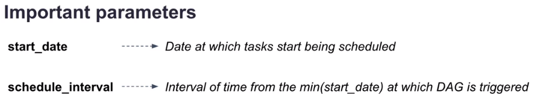
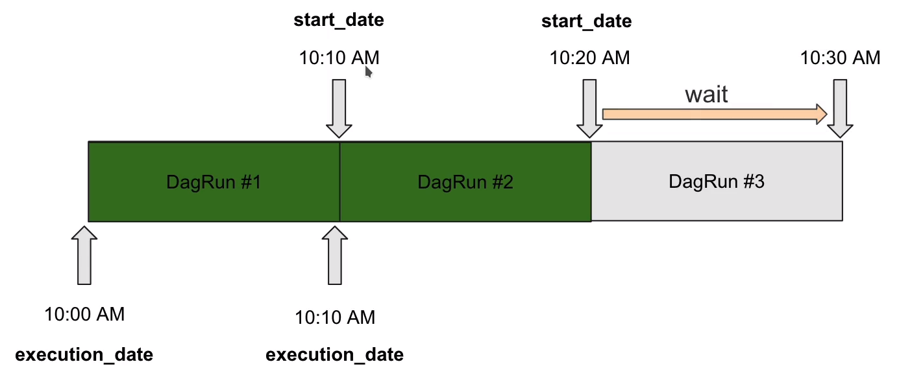
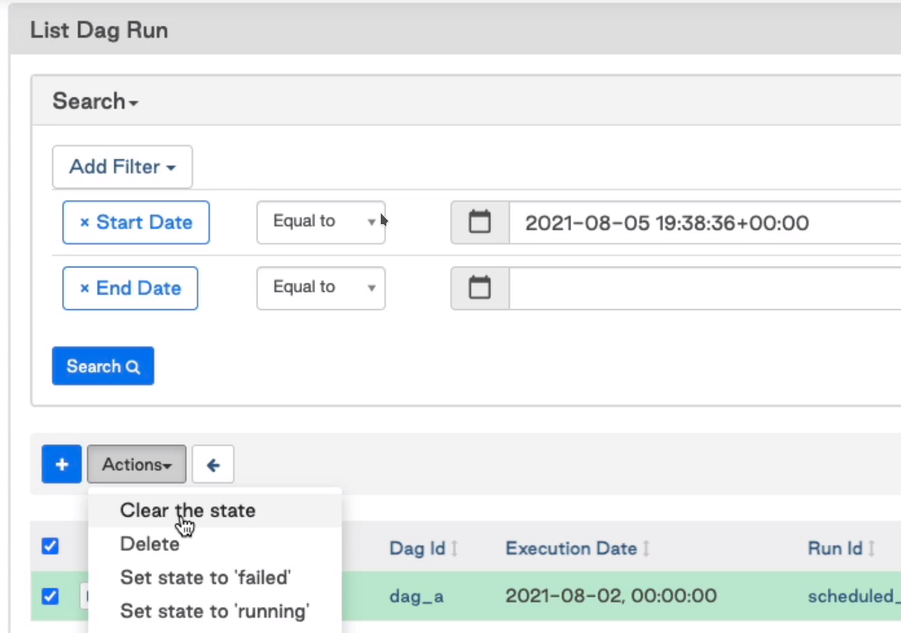
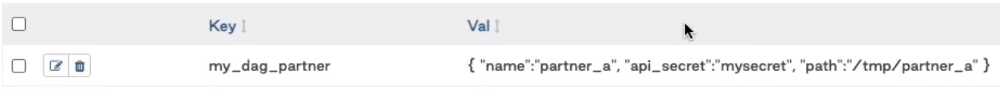
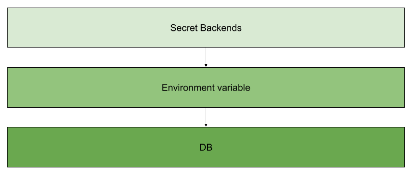
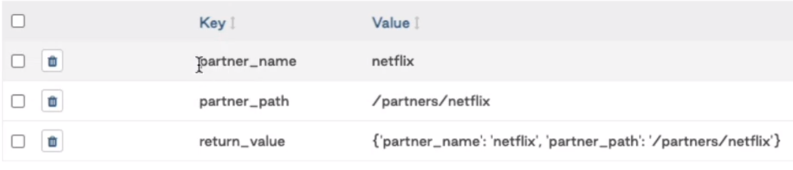
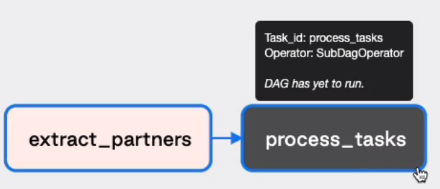
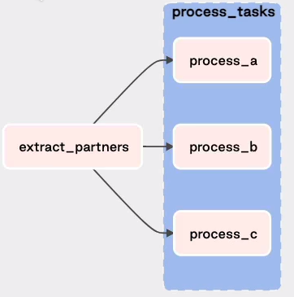
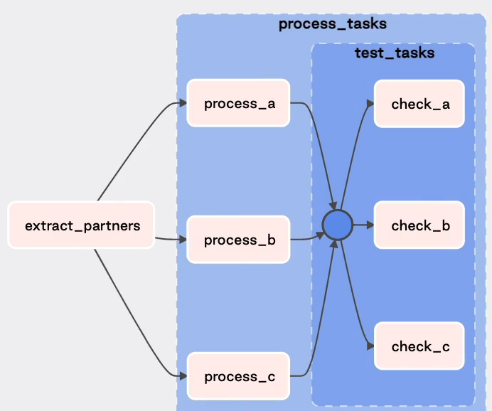

# Airflow Dag Authoring
## Table of Contents
1. [The basis](#the-basis)
2. [Master your Variables](#master-your-variables)
3. [The power of the TaskFlow API](#the-power-of-the-taskflow-api)
4. [Grouping your tasks](#grouping-your-tasks) 
5. [Advanced Concepts](./02_airflow_dag_authoring_advanced.md)
6. [DAG dependencies](./02_airflow_dag_authoring_advanced.md)

## The basis
### Define your Dags

* DAG_DISCOVERY_SAFE_MODE
The Schedule tries to parse any file inf `dags/` folder if this contains `dag` or `airflow` words.
> If you generate your dags dynamically these twos words are necessary.

* airflowignore 
Is a file similar to `gitignore`, and define files that the airflow scheduler ignores in dags
folder.

* Dag Id The Id have to be unique, 
* Each task/operator can have start_date
* schedule_interval: define execution frequency
* dagrun_timeout: doesn't have default value and its have to greater than execution time.
* tags: allow filter dags by tags.
* catchup: allow triggers dags automatically 

```python
from airflow import DAG
from datetime import datetime, timedelta

with DAG(
    "my_dag",
    description="DAG in charge of proc custom",
    start_date=datetime(2021, 1, 1),
    schedule_inderval="@daily",
    dagrun_timeout=timedelta(minutes=10),
    tags=["DataEng", "Ingestion"],
    chatchup=False
) as dag:
   
```

### DAG scheduling

* `start_date`: defines the date at which a dag starts being schedule
  * datatype: `datetime` object
* `schedule_interval`: defines the frequency  at which your dag is trigger
  * datatype: cron expresion (`string**) or `timedelta** object.




The DAG starts being scheduled from the `start_date` and will be triggerd after every
`schedule_interval`. And the first `execution_date` will be `start_date` + `schedule_interval`



### Cron vs Timedelta

The difference between these is that the cron expresion is **stateless** whereas timedelta object is
**statefull** means The timedelta execute a DAG based on previous execution date. 

### Task Idempotency and Determinism 

* **Deterministic**: Given a task you will get same output for the same input 
* **Idempotent**: If you execute multiple times your task, it always will produce the same effect.


The next task is not idempotent, becuase the second execution will fail. 
```python
PostgresOperator(task_id="create_table", sql="CREATE TABLE my_table ...")
```

### Backfilling
If you specify `start_date` in a past date, automatically airflow
will execute all non-trigger dag runs since this "past date".

You automatically backfill your data for this period of time. 

For disable this behavior you must set `catchup=False`.

Still if `catchup` is false, you will be able to backfill your dags usign the cli.
```bash
airflow dags backfill -s 2020-01-01 -e 2021-01-01
```

To avoid have many dags runs due to the backfilling is possible use
`max_active_runs` argument.

```python
from airflow import DAG
from datetime import datetime, timedelta

with DAG(
    "my_dag",
    description="DAG in charge of processing customoer data ",
    start_date=datetime(2021, 1, 1),
    schedule_inderval="@daily",
    dagrun_timeout=timedelta(minutes=10),
    tags=["DataEng", "Ingestion"],
    chatchup=False,
    max_active_runs=1
) as dag: 
```

Also is possible use backfilling using UI.


## Master your Variables
### Variables
To create new variables in UI go to Admin -> Variables (Also is possible use API)

To Use variables
```python
from airflow.model import Variable

def _extract():
    # this create a conexion with metadata db and get the var.
    partner = Variable.get("my_dag_partner")
```

Recommendations:
* Use prefix to relate variables with dags. `my_dag_var_name`
* add suffix `_secret` for hide the variable value


### Properly fetch your Variables

* Variable as global python variable
Do not call `Variable` object where it is not necessary, becuase
it creates a new conexion every dag is **parsed**.
```python
Variable.get("my_dag_partner")

with DAG( ...
```

* Multiple Variables
Instead of create conexion multiple times for every variable that is needed.
Define one variable using a dictionary definition.



```python
from airflow.model import Variable

def _extract():
    # this create a conexion with metadata db and get the var.
    partner_settings = Variable.get("my_dag_partner", deserialize_json=True)
    name = partner_settings["name"] 
    ...
```
* Using Jinja templates
This avoid create a new conexion every time that the dag is parsed.

```python
extract = PythonOperator(
    task_id="ectract",
    python_callable=_extract
    op_args=["{{ var.json.my_dag_partner.name }}"]
)

```

### The Power of Environment Variables

* Using Environment variables
Adding the prefix `AIRFLOW_VAR_` airflow knows that it is in fact a 
airflow variable.

In docker
```dockerfile
ENV AIRFLOW_VAR_MY_DAG_PARTNER='{"name":"partner_a","api_secret":"mysecret", "path":"/tmp/p"}' 
```
in Bash 
```bash
export AIRFLOW_VAR_MY_DAG_PARTNER='{"name":"partner_a","api_secret":"mysecret", "path":"/tmp/p"}' 
```
This variables are hidden from the users if you use
```bash
airflow variables list
```
it does not show any variable. but the variable exists.

* Additional notes
There are 6 different ways of creating variables in Airflow
* Airflow UI :good:
* Airflow CLI  :good:
* REST API  :good:
* Environment Variables :heart:
* Secret Backend :heart:
* Programatically :x:

Whether to choose one way or another depends on your use case and what you prefer.

Overall, by creating a variable  with an environment variable you

* avoid making a connection to your DB
* hide sensitive values (you variable can be fetched only within a DAG)

Notice that it is possible to create connections with environment variables. You just have to export the env variable:

`AIRFLOW_CONN_NAME_OF_CONNECTION=your_connection`

and get the same benefits as stated previously.

Ultimately, if you really want a secure way of storing your variables or connections, use a Secret Backend.

To learn more about this, click on this [link](https://airflow.apache.org/docs/apache-airflow/stable/security/secrets/secrets-backend/index.html)

Finally, here is the order in which Airflow checks if your variable/connection exists:




## The power of the TaskFlow API
### Add data at runtime with templating

* Using Jinja templates
use jinja template on arguments defined as template file (templated).
ins this case use `sql` arg where `ds` the execution date from the dag run.

```python
from airflow.providers.prostgres.operators.porstgres import PostgresOperator

with Dag(...) as dag:
    fetch = PostgresOperator(
        task_id="fetching_data",
        sql="SELECT partner_name FROM partners WHERE date={{ ds }}"
    )
```
Also is possible use sql files. 
```python
    fetch = PostgresOperator(
        task_id="fetching_data",
        sql="sql/my_request.sql"
    )
```
Where the sql files is in:
```sh
dags
└── sql
    └── my_request.sql
```

```sql
SELECT partner_name FROM partners WHERE date={{ ds }};
```

* [astronomer doc](https://registry.astronomer.io/)

* Custom Operator
```python

from airflow.providers.prostgres.operators.porstgres import PostgresOperator

class CustomPostgresOperator(PostgresOperator):
    template_fileds = ("sql", "paramters", "partner_name")

with Dag(...) as dag:
    fetch = CustomPostgresOperator(
        task_id="fetching_data",
        sql="sql/my_request.sql",
        paramters={
            "next_ds": "{{ next_ds }}",
            "prev_ds": "{{ prev_ds }}",
            "partner_name": "{{ var.json.my_dag_partner.name }}"
        }
    )

```

### Sharing data with XCOMs and limitations
To share data between two tasks use XCOMs.

* XCOMs
```python
def _extract(ti):
    # where ti is task instance object
    
    # serialize the value as json value.
    # this value do not have used to save secret values.
    ti.xcom_push(key="partner_name", value="netflix")

def _process(ti):
    # where ti is task instance object
    
    # serialize the value as json value.
    name = ti.xcom_pull(key="partner_name", task_id="extract")
```

* Limitations based on sizes (depends on database)
  * SQLite: 2GB
  * Posgres: 1GB
  * MySQL: 64KB
If the sizes are exceed you will get memory overflow error.
> XCOMs is used to share data references but not data.

Also is possible use only return from python
```python
def _extract():
    return "netflix"

def _process(ti):
    # where ti is task instance object
    
    # serialize the value as json value.
    # name = ti.xcom_pull(key="return_value", task_id="extract")
    name = ti.xcom_pull(task_id="extract")
```

If you need share mutiple values between tasks you should use a dictionary as same as airflow
variables. (not create multiple conexion)


### The new way of creating DAGs
* TaskFlow API:
  * Decorators: Allow create DAGs easier and faster than the classic way.
    - `@task.python`: to execute a python function without create a `PythonOperator`
    - `@task.virtualenv`: To execute a python function within a virtual env.
    - `@task_group`: Allow multiple tasks.
    
    ```python
    from airflow.decoratos import task
    
    @task.python
    def extract():
        ...
        
    with DAG(...) as dag:
        
        ...
        # without PythonOperator
        extraxt() >> task_2
         
    ```
    > Also exists `@dag` decorator. 
    
    
  * XCOM args: Do explicit data dependency between two tasks.
    - Is able to share data without `xcom_push` and `xcom_pull`

    ```python
    from airflow.decoratos import task, dag
    
    @task.python
    def extract():
        partner_name = "netflix"
        return parter_name

    @task.python
    def process(partner_name):
        print(parter_name)

    
    @dag(...)
    def my_dag():
        ...
        # without PythonOperator
        # without xcom pull and push
        process(extraxt())
    ```
### XComs with the TaskFlow API
Useful to share two arguments individually without use xcom pull and push

```python
    @task.python(task_id="extract_partners", multiple_outputs=True)
    def extract():
        partner_name = "netflix"
        partner_value = "path/to/some"
        return {"parner_name": partner_name, "partner_value": partener_value}
        
    @task.python
    def process(partner_name, parnter_value):
        print(parter_name)
        print(parter_value)
```

Getting:


To avoid return value json serialized, use
```python
    @task.python(task_id="extract_partners", do_xcom_push=False, multiple_outputs=True)
```

Another option is to use Dictionaries
```python
    from airflow.decoratos import task
    from typing import Dict

    @task.python(task_id="extract_partners")
    def extract() -> Dict[str, str]:
        partner_name = "netflix"
        partner_value = "path/to/some"
        return {"parner_name": partner_name, "partner_value": partener_value}
```
### SubDAGs: The Hard Way of Grouping your Tasks

* SubDAG: Is a DAG within another DAG. and put in this all task that needs run together.

Where subdags are in:
```sh
dags
└── subdag
    └── subdag_factory.py
```

```python
from airflow.opertators.subdag import SubDagOperator
from datetime import datetime
from subdags.subdag_factory import subdag_factory
from airflow.decoratos import task

default_args = {
    "start_date": datetime(2021, 11, 21)
}


@task.python(task_id="extract_partners", do_xcom_push=False, multiple_outputs=True)
def extract()

with DAG(..., default_args=default_args) as dag:

    partner_setting = extract()
    process_tasks = SubDagOperator(
        task_id="process_task",
        subdag=subdag_factory("my_dag", "process_tasks", defaults_args),
        poke_interval=15  # seconds to pulling status
    )
```

```python
# subdag_factory.py
from airflow.models import DAG
from airflow.operatos.python import get_concurrent_context
from airflow.decoratos import task

@task.python
def process_a():
    ti = get_current_context()["ti"]
    name = ti.xcom_pull(key="partner_name", task_ids="extract_partners", dag_id="my_dag")
    path = ti.xcom_pull(key="partner_path", task_ids="extract_partners", dag_id="my_dag")
    print(name, path)
    
def subdag_factory(parent_dag_id, subdag_dag_id, default_args):
    with DAG(
        f"{partent_dag_id}.{subdag_dag_id}", 
        default_args=default_args
    ) as dag:
        
        process_a()
        
   return dag 
```

> NOTE: airflow is not able to map xcom from parten Dag tasks to children dag tasks using TaskFlow
> API



### TaskGroups: The Best Way of Grouping your Tasks
The tasks are showed together by UI

```python
from airflow.utils.task_group import TaskGroup
from airflow.decoratos import task

@task.python
def process_a(name, path):
    print(name, path)

with DAG(...) as dag:

    partner_settings = extract()
    with TaskGroup(group_id="process_tasks") as process_tasks:
       process_a(partener_settings["partner_name"], partner_settings=["partner_path"])
       ...
```




Also is possible create task groups within task groups 
```python
with TaskGroups(group_id="process_tasks") as partner_tasks:
    with TaskGroup(group_id="test_tasks") as test_tasks:
        check_a()
        ...

    process_a(partener_settings["partner_name"], partner_settings=["partner_path"]) >> test_tasks
    ...
```


There are decorators too for taskGropus `@tasks_groups`
